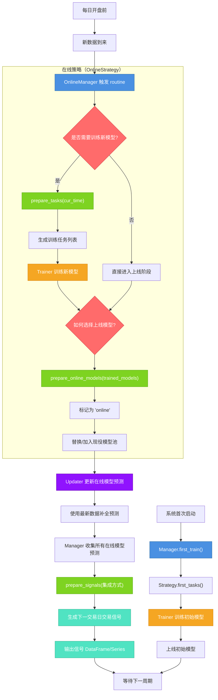

## Online Serving 实时市场预测与交易

**“在线策略”是一套动态管理模型生命周期的规则：决定**什么时候训练新模型、什么时候上线模型、什么时候生成交易信号**，以适应不断变化的市场。**

| 问题 | 传统回测的缺陷 | 在线策略的解决方案 |
|------|----------------|------------------|
| **市场在变** | 回测用历史数据训练一个模型，实盘时失效 | **定期重新训练**，动态上线新模型 |
| **模型会过时** | 固定模型无法适应新风格 | **滚动训练 + 动态切换** |
| **信号需实时** | 回测信号是“事后诸葛亮” | **每日更新预测 → 生成下一交易日信号** |
| **多模型管理混乱** | 手动切换模型容易出错 | **自动化管理上线/下线** |

> **核心思想**：**模型不是“一劳永逸”的，而是“活的”——要随着市场不断迭代。**

### 核心概念总览（4 个关键角色）

| 角色 | 比喻 | 职责 |
|------|------|------|
| **Online Manager** | 指挥中心 | 统筹所有策略，控制每日流程 |
| **Online Strategy** | 作战方案 | 决定“什么时候训练、用哪个模型、怎么出信号” |
| **Online Model** | 现役士兵 | 当前参与预测的模型（可动态替换） |
| **Updater** | 后勤补给 | 当新数据到来时，更新预测/标签 |

### “在线策略”的工作流程

| 决策 | 问题 | 典型实现 |
|------|------|----------|
| **任务生成** | 今天要不要训练新模型？ | 每 30 天滚动训练一次 |
| **模型上线** | 训练好了，哪个模型上场？ | 选 IC 最高的 / 全部平均 |
| **信号准备** | 怎么把预测变成交易信号？ | 取预测分数的平均值 |

### 运行模式对比

| 模式 | 用途 | 训练时机 | 推荐 Trainer |
|------|------|----------|--------------|
| **实时模式（Online）** | 实盘部署 | 每日例行时训练 | `Trainer`（逐一训练） |
| **模拟模式（Simulation）** | 历史回测验证 | 所有任务准备好后**一次性训练** | `DelayTrainer`（并行加速） |

### 关键概念

#### **Online Model（现役模型）**
- **定义**：当前参与预测的模型集合。
- **特点**：
  - 数量可变（1个或多个）。
  - 随时可替换（老模型下线，新模型上线）。
  - 有标签标记：`online` / `offline`。
- **比喻**：足球队中的首发阵容。

#### **Routine（例行流程）**
- **定义**：一个固定周期（如每天）的更新流程。
- **内容**：
  1. 检查新数据
  2. 准备训练任务
  3. 训练模型
  4. 上线模型
  5. 生成信号
- **频率**：默认 `'day'`，可支持分钟级。

#### **Updater（更新器）**
- **作用**：当**新数据到来**时，自动用现役模型**补预测**。
- **场景**：
  - 昨晚收盘数据更新了
  - 需要预测今天的因子值
  - Updater 自动加载模型，补全预测
- **支持类型**：`PredUpdater`（预测）、`LabelUpdater`（标签）

### 小结

| 普通回测 | 在线策略 |
|----------|----------|
| 静态模型 | 动态模型 |
| 一次性训练 | 滚动训练 |
| 历史信号 | 实时信号 |
| 无法实盘 | 可部署实盘 |

| 场景 | 在线策略设计 |
|------|--------------|
| **风格轮动** | 每月训练一个新 LightGBM，上线 IC 最高者 |
| **多模型集成** | 每周训练 3 个模型（GBDT、NN、LR），上线后取平均 |
| **高频信号** | 每 5 分钟滚动训练，生成分钟级买卖信号 |

1. **在线策略 = 模型的动态管理规则**  
2. **核心任务：训练 → 上线 → 出信号**  
3. **随市场变化，模型也要“呼吸”**  
4. **Manager 管流程，Strategy 管决策**  
5. **Updater 是“补货员”，保证预测不缺货**