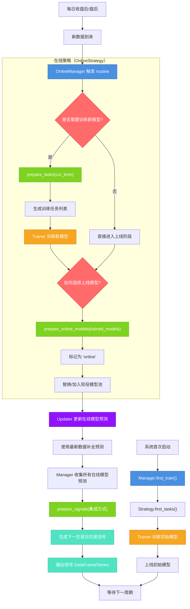

## Online Serving 实时市场预测与交易

**“在线策略”是一套动态管理模型生命周期的规则：决定**什么时候训练新模型、什么时候上线模型、什么时候生成交易信号**，以适应不断变化的市场。**

| 问题 | 传统回测的缺陷 | 在线策略的解决方案 |
|------|----------------|------------------|
| **市场在变** | 回测用历史数据训练一个模型，实盘时失效 | **定期重新训练**，动态上线新模型 |
| **模型会过时** | 固定模型无法适应新风格 | **滚动训练 + 动态切换** |
| **信号需实时** | 回测信号是“事后诸葛亮” | **每日更新预测 → 生成下一交易日信号** |
| **多模型管理混乱** | 手动切换模型容易出错 | **自动化管理上线/下线** |

> **核心思想**：**模型不是“一劳永逸”的，而是“活的”——要随着市场不断迭代。**

### 核心概念总览（4 个关键角色）

| 角色 | 比喻 | 职责 |
|------|------|------|
| **Online Manager** | 指挥中心 | 统筹所有策略，控制每日流程 |
| **Online Strategy** | 作战方案 | 决定“什么时候训练、用哪个模型、怎么出信号” |
| **Online Model** | 现役士兵 | 当前参与预测的模型（可动态替换） |
| **Updater** | 后勤补给 | 当新数据到来时，更新预测/标签 |

### “在线策略”的工作流程


```mermaid
flowchart TD
    %% ==== 样式定义 ====
    classDef strategy fill:#7ED321,stroke:#5BA818,color:#fff
    classDef manager fill:#4A90E2,stroke:#2E6DA4,color:#fff
    classDef model fill:#F5A623,stroke:#D4840E,color:#fff
    classDef signal fill:#50E3C2,stroke:#35B290,color:#fff
    classDef data fill:#9013FE,stroke:#6A0DAD,color:#fff
    classDef decision fill:#FF6B6B,stroke:#D64545,color:#fff

    %% ==== 主流程 ====
    A["每日收盘后/盘后"] --> B["新数据到来"]
    B --> C["OnlineManager 触发 routine"]

    subgraph 在线策略核心决策 [在线策略（OnlineStrategy）]
        C --> D{"是否需要训练新模型?"}
        D -->|是| E["prepare_tasks(cur_time)"]
        E --> F["生成训练任务列表"]
        F --> G["Trainer 训练新模型"]
        D -->|否| H["直接进入上线阶段"]

        G --> I{"如何选择上线模型?"}
        H --> I
        I --> J["prepare_online_models(trained_models)"]
        J --> K["标记为 'online'"]
        K --> L["替换/加入现役模型池"]
    end

    L --> M["Updater 更新在线模型预测"]
    M --> N["使用最新数据补全预测"]
    N --> O["Manager 收集所有在线模型预测"]

    O --> P["prepare_signals(集成方式)"]
    P --> Q["生成下一交易日交易信号"]
    Q --> R["输出信号 DataFrame/Series"]
    R --> S["等待下一周期"]

    %% ==== 首次启动 ====
    T["系统首次启动"] --> U["Manager.first_train()"]
    U --> V["Strategy.first_tasks()"]
    V --> W["Trainer 训练初始模型"]
    W --> X["上线初始模型"]
    X --> S

    %% ==== 样式绑定 ====
    class D,I decision
    class E,J,P strategy
    class C,U manager
    class G,W model
    class M data
    class Q,R signal
```

| 决策 | 问题 | 典型实现 |
|------|------|----------|
| **任务生成** | 今天要不要训练新模型？ | 每 30 天滚动训练一次 |
| **模型上线** | 训练好了，哪个模型上场？ | 选 IC 最高的 / 全部平均 |
| **信号准备** | 怎么把预测变成交易信号？ | 取预测分数的平均值 |

### 运行模式对比

| 模式 | 用途 | 训练时机 | 推荐 Trainer |
|------|------|----------|--------------|
| **实时模式（Online）** | 实盘部署 | 每日例行时训练 | `Trainer`（逐一训练） |
| **模拟模式（Simulation）** | 历史回测验证 | 所有任务准备好后**一次性训练** | `DelayTrainer`（并行加速） |

### 关键概念

#### **Online Model（现役模型）**
- **定义**：当前参与预测的模型集合。
- **特点**：
  - 数量可变（1个或多个）。
  - 随时可替换（老模型下线，新模型上线）。
  - 有标签标记：`online` / `offline`。
- **比喻**：足球队中的首发阵容。

#### **Routine（例行流程）**
- **定义**：一个固定周期（如每天）的更新流程。
- **内容**：
  1. 检查新数据
  2. 准备训练任务
  3. 训练模型
  4. 上线模型
  5. 生成信号
- **频率**：默认 `'day'`，可支持分钟级。

#### **Updater（更新器）**
- **作用**：当**新数据到来**时，自动用现役模型**补预测**。
- **场景**：
  - 昨晚收盘数据更新了
  - 需要预测今天的因子值
  - Updater 自动加载模型，补全预测
- **支持类型**：`PredUpdater`（预测）、`LabelUpdater`（标签）

---

## 日频落地：什么时候训练、怎么训练、如何预测（可运行示例）

下面以**日频（A 股日线）**为例，给出一个“能跑通”的最小闭环：  
**T 日收盘后（或数据入库后）更新预测与信号；每 N 个交易日滚动训练一次新模型；信号用于 T+1 交易日。**

### 1）推荐时间轴（以 T 日为例）

| 时间点 | 你做什么 | Qlib 在线组件在做什么 |
|---|---|---|
| **T 日收盘后 / 数据落库后** | 确认 `provider_uri` 数据已更新到 T 日 | `OnlineManager.routine(cur_time=T)` 被触发 |
| 例行流程开始 | （可选）检查是否到达训练窗口（如每 20 个交易日） | `OnlineStrategy.prepare_tasks(T)`：决定是否产出训练任务 |
| 训练阶段（不一定每天） | 训练新模型（LightGBM 等）并写入实验记录 | `TrainerR.train(tasks)`：产出若干 `Recorder`（含 `params.pkl/dataset/pred.pkl`） |
| 上线阶段 | 选择“现役模型”（新模型替换旧模型，或保留多模型） | `prepare_online_models(trained_models)`：给 `Recorder` 打 `online/offline` tag |
| **预测更新（每天）** | 用现役模型把预测补到 T 日 | `tool.update_online_pred(to_date=T)`（底层 `PredUpdater`） |
| **生成信号（每天）** | 从预测聚合出“下一交易日信号” | `OnlineManager.prepare_signals()`（默认 `AverageEnsemble`） |
| **T+1 开盘前** | 从 `signals` 取出 T 日对应的截面，转成订单/权重 | 你的交易系统执行下单 |

> 关键点：**训练可以低频（例如每月/每 20 交易日），但预测与信号建议日更**，这样模型再训练前也能持续产出可用信号。

### 2）最小可运行代码：每 20 个交易日训练一次，日更预测与信号

> 说明：示例使用仓库内的 `data/qlib_data/cn_data`；若你用的是别的路径，替换 `provider_uri` 即可。

```python
import copy
import pandas as pd

import qlib
from qlib.config import REG_CN
from qlib.data import D
from qlib.model.trainer import TrainerR
from qlib.utils import get_date_by_shift
from qlib.workflow.online.manager import OnlineManager
from qlib.workflow.online.strategy import OnlineStrategy
from qlib.workflow.online.utils import OnlineToolR
from qlib.workflow.task.collect import RecorderCollector
from qlib.workflow.task.gen import RollingGen


def handler_fit_end_mod(task: dict, rolling_gen: RollingGen):
    """
    RollingGen 默认只会在必要时延长 handler.end_time。
    日频滚动训练更常见的需求是：让 handler.fit_end_time 跟随 train 段末尾滚动（避免归一化统计长期不更新）。
    """
    try:
        segs = task["dataset"]["kwargs"]["segments"]
        hkwargs = task["dataset"]["kwargs"]["handler"]["kwargs"]
        # 用训练段末尾更新 fit_end_time
        if "fit_end_time" in hkwargs and "train" in segs:
            hkwargs["fit_end_time"] = segs["train"][1]
        # 确保 handler.end_time 至少覆盖到 test 段末尾（用于生成/更新 pred）
        if hkwargs.get("end_time") is not None and rolling_gen.test_key in segs:
            hkwargs["end_time"] = segs[rolling_gen.test_key][1]
    except Exception:
        # 只是示例：防御性处理，避免因为配置差异导致滚动失败
        return


class NDayRetrainDailyPredictStrategy(OnlineStrategy):
    """
    - 训练频率：每 N 个交易日滚动训练一次（通过 RollingGen.step 控制）
    - 预测频率：每天补到最新交易日
    - 上线规则：若训练出新模型，上线“最新的那个”；否则沿用旧在线模型
    """

    def __init__(self, name_id: str, task_template: dict, rolling_gen: RollingGen):
        super().__init__(name_id=name_id)
        self.exp_name = name_id
        self.task_template = task_template
        self.rg = rolling_gen
        self.tool = OnlineToolR(self.exp_name)

    def first_tasks(self):
        # 首次启动：训练一个初始模型（用于立即上线 + 后续 PredUpdater 增量补预测）
        return [copy.deepcopy(self.task_template)]

    def prepare_tasks(self, cur_time, **kwargs):
        # 日常例行：只有当“滚动窗口推进超过上一次 test 段”时才生成新任务（相当于每 N 个交易日训练一次）
        online_models = self.tool.online_models()
        if not online_models:
            return self.first_tasks()

        # 基于“当前在线模型的 task”生成后续滚动任务
        last_task = online_models[-1].load_object("task")
        return list(self.rg.gen_following_tasks(last_task, pd.Timestamp(cur_time)))

    def prepare_online_models(self, trained_models, cur_time=None):
        if trained_models:
            # 这里只演示“上线最新的一个”。你也可以上线多个，然后在 prepare_signals 里做集成。
            best = trained_models[-1]
            self.tool.reset_online_tag([best])
            return [best]
        return self.tool.online_models()

    def get_collector(self):
        # 只收集在线模型的预测，避免离线模型污染 signals
        return RecorderCollector(
            experiment=self.exp_name,
            rec_filter_func=lambda rec: self.tool.get_online_tag(rec) == self.tool.ONLINE_TAG,
            artifacts_path={"pred": "pred.pkl"},
        )


def build_task_template(end_time: str) -> dict:
    """
    构造一个最小任务：
    - Alpha158 特征 + LightGBM
    - 训练/验证/测试段：只要给出“初始”分段即可，后续由 RollingGen 负责滚动
    """
    end_time = pd.Timestamp(end_time)
    test_end = end_time
    test_start = get_date_by_shift(test_end, -19, freq="day")  # 20 个交易日
    valid_end = get_date_by_shift(test_start, -1, freq="day")
    valid_start = get_date_by_shift(valid_end, -59, freq="day")  # 约 60 个交易日验证
    train_end = get_date_by_shift(valid_start, -1, freq="day")

    return {
        "model": {
            "class": "LGBModel",
            "module_path": "qlib.contrib.model.gbdt",
            "kwargs": {
                "learning_rate": 0.05,
                "num_leaves": 64,
                "colsample_bytree": 0.9,
                "subsample": 0.9,
                "n_estimators": 200,
            },
        },
        "dataset": {
            "class": "DatasetH",
            "module_path": "qlib.data.dataset",
            "kwargs": {
                "handler": {
                    "class": "Alpha158",
                    "module_path": "qlib.contrib.data.handler",
                    "kwargs": {
                        "start_time": "2008-01-01",
                        "end_time": end_time.strftime("%Y-%m-%d"),
                        "fit_start_time": "2008-01-01",
                        "fit_end_time": train_end.strftime("%Y-%m-%d"),
                        "instruments": "csi300",
                    },
                },
                "segments": {
                    "train": ("2008-01-01", train_end.strftime("%Y-%m-%d")),
                    "valid": (valid_start.strftime("%Y-%m-%d"), valid_end.strftime("%Y-%m-%d")),
                    "test": (test_start.strftime("%Y-%m-%d"), test_end.strftime("%Y-%m-%d")),
                },
            },
        },
        "record": [{"class": "SignalRecord"}],  # 生成 pred.pkl / label.pkl
    }


if __name__ == "__main__":
    qlib.init(provider_uri="data/qlib_data/cn_data", region=REG_CN)

    # 以数据中“最新交易日”为当天 T（生产环境一般也是这样）
    cur_time = D.calendar(freq="day").max()

    task_template = build_task_template(cur_time)
    rolling_gen = RollingGen(step=20, rtype=RollingGen.ROLL_EX, ds_extra_mod_func=handler_fit_end_mod)  # 每 20 交易日训练一次（扩窗）
    strategy = NDayRetrainDailyPredictStrategy("day_lgbm_v1", task_template, rolling_gen)

    manager = OnlineManager(strategies=strategy, trainer=TrainerR(), begin_time=cur_time, freq="day")

    # 1) 首次启动：训练并上线一个初始模型
    manager.first_train()

    # 2) 每日例行：训练（若到期）+ 补预测 + 生成 signals
    manager.routine(cur_time=cur_time)

    signals = manager.get_signals()  # MultiIndex(datetime, instrument) -> score
    latest_dt = signals.index.get_level_values("datetime").max()
    today_cross_section = signals.xs(latest_dt, level="datetime").sort_values(ascending=False)
    print("latest_dt:", latest_dt)
    print(today_cross_section.head(10))
```

### 3）“如何预测”：两种常见用法

1. **走完整例行流程（推荐）**：`manager.routine(cur_time=T)`  
   - 训练（可选）→ 上线（可选）→ **补预测** → 生成 `signals`。
2. **只补预测（不重新训练）**：`strategy.tool.update_online_pred(to_date=T)`  
   - 适合：你只想更新 `pred.pkl`，后续信号由别的系统生成/集成。

### 4）把 signals 变成交易指令（最小示例）

`signals` 默认是一个**排序分数**（分数越高越“看多”），你可以在 T 日生成的截面上做 TopK：

```python
topk = 50
cs = today_cross_section  # 上面示例的截面 Series
buy_list = cs.head(topk).index.tolist()
sell_list = cs.tail(topk).index.tolist()
```

生产中通常还会加：交易约束（停牌/涨跌停/成份股池）、仓位控制、行业中性、成交量约束等。

### 5）上线运维建议（很重要）

- **数据先到、流程后跑**：日频最常见故障是“日历到 T 了，但 features 还没更新到 T”，会导致预测缺口或标签错位。
- **输出对齐**：明确你的信号含义是“用 T 日信息交易 T+1”还是“用 T 日盘中信息交易 T 日收盘”，并在执行层强制校验时间戳。
- **可回滚**：上线新模型后保留上一版在线模型（或至少保留上一版 Recorder id），出现异常时一键切换 tag。
- **监控三件套**：数据完整性（缺票/缺字段/日历差）、预测分布漂移（均值/方差/分位）、策略层面指标（换手、暴露、回撤）。

### 小结

| 普通回测 | 在线策略 |
|----------|----------|
| 静态模型 | 动态模型 |
| 一次性训练 | 滚动训练 |
| 历史信号 | 实时信号 |
| 无法实盘 | 可部署实盘 |

| 场景 | 在线策略设计 |
|------|--------------|
| **风格轮动** | 每月训练一个新 LightGBM，上线 IC 最高者 |
| **多模型集成** | 每周训练 3 个模型（GBDT、NN、LR），上线后取平均 |
| **高频信号** | 每 5 分钟滚动训练，生成分钟级买卖信号 |

1. **在线策略 = 模型的动态管理规则**  
2. **核心任务：训练 → 上线 → 出信号**  
3. **随市场变化，模型也要“呼吸”**  
4. **Manager 管流程，Strategy 管决策**  
5. **Updater 是“补货员”，保证预测不缺货**
